# 🏡 Le Ranch sur PokéLegend

Le <mark style="color:blue;">**Ranch**</mark> est un item rare permettant l'accouplement de Pokémon sur le serveur <mark style="color:blue;">**PokéLegend**</mark>. Il permet d'obtenir des œufs sous certaines conditions et offre diverses optimisations.

<figure>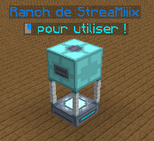<figcaption>
<mark style="color:blue;"><strong><code>Le Ranch en jeu</code></strong></mark>
</figcaption></figure>

## 🎁 Obtention du Ranch
Le <mark style="color:blue;">**Ranch**</mark> peut être obtenu de différentes manières :
- Dans les <mark style="color:blue;">**drops de boss**</mark>
- Via l'<mark style="color:blue;">**achat auprès d'autres joueurs**</mark> au sein de leur `/pw` personnel.

## ⚙️ Fonctionnement du Ranch
Une fois posé, le Ranch permet d'accoupler <mark style="color:blue;">**deux Pokémon**</mark> (un mâle et une femelle) sous certaines conditions.

### 🌱 Fertilité des Pokémon
- Chaque Pokémon possède un <mark style="color:blue;">**indice de fertilité**</mark> compris entre <mark style="color:blue;">**0 et 10**</mark>.
- Chaque utilisation du Ranch consomme <mark style="color:blue;">**1 point de fertilité**</mark>.
- Si un Pokémon atteint <mark style="color:blue;">**0 de fertilité**</mark>, il ne peut plus être utilisé dans le Ranch et un message s'affichera :  
  ➜ *"Vos Pokémon n'ont plus de fertilité".*

<figure><figcaption>
<mark style="color:blue;"><strong><code>Fertilité d'un Pokémon</code></strong></mark>
</figcaption></figure>

### 💑 Compatibilité entre Pokémon
Les Pokémon doivent appartenir au <mark style="color:blue;">**même groupe de reproduction**</mark> pour être compatibles. Les groupes existants sont :
- Terrestre
- Aquatique 1
- Aquatique 2
- Aquatique 3
- Amorphe
- Monstrueux
- Humanoïde
- Aérien
- Draconique
- Minéral
- Insectoïde
- Féérique
- Végétal
- Inconnu
  ➜ *Les catégories Inconnues ne permettent pas une reproduction entre Pokémon.*

## 🥚 Obtention et éclosion des Œufs
Si les conditions sont réunies, le Ranch produira un <mark style="color:blue;">**œuf de Pokémon**</mark>. Cet œuf peut éclore de deux manières :
- <mark style="color:blue;">**Instantanément**</mark> avec la commande `/hatch`
- <mark style="color:blue;">**En marchant**</mark> avec l'œuf dans un slot de Pokémon actif

## 🚀 Améliorations du Ranch
### 🕰️ Mise à jour hors ligne
L'<mark style="color:blue;">**item "Mise à jour hors ligne"**</mark> permet au Ranch de fonctionner même si son propriétaire est <mark style="color:blue;">**hors-ligne**</mark>. Cet item est récupérable en :
- L'achetant auprès d'autres joueurs
- Le trouvant dans la <mark style="color:blue;">**Caisse Master**</mark>
- L'achetant dans l'<mark style="color:blue;">**Hôtel de Ville**</mark>

Pour l'utiliser : <mark style="color:blue;">**clic droit**</mark> sur le Ranch.

### 🏗️ Optimisation via des Builds
Des constructions spécifiques autour du Ranch permettent <mark style="color:blue;">**d'accélérer la production d'œufs**</mark>.
- Le <mark style="color:blue;">**bonus de vitesse**</mark> peut atteindre jusqu'à <mark style="color:blue;">**+200%**</mark>.
- Certains blocs ou structures peuvent influencer ce bonus.

Voici toutes les structures réalisables afin d'obtenir ce <mark style="color:blue;">**boost**</mark> :

<figure>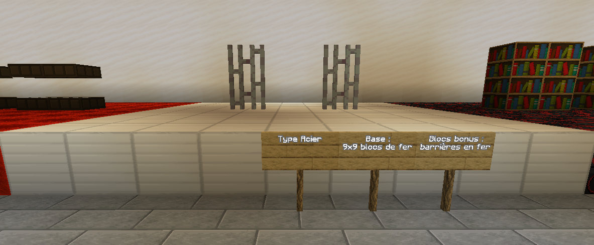<figcaption>
<mark style="color:blue;"><strong><code>Structure pour les Pokémons Acier</code></strong></mark>
</figcaption></figure>

<figure>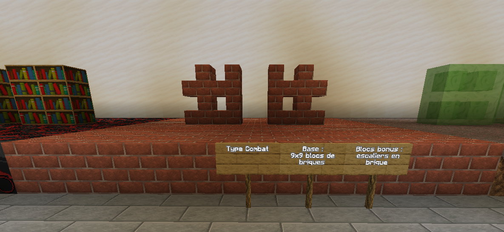<figcaption>
<mark style="color:blue;"><strong><code>Structure pour les Pokémons Combat</code></strong></mark>
</figcaption></figure>

<figure>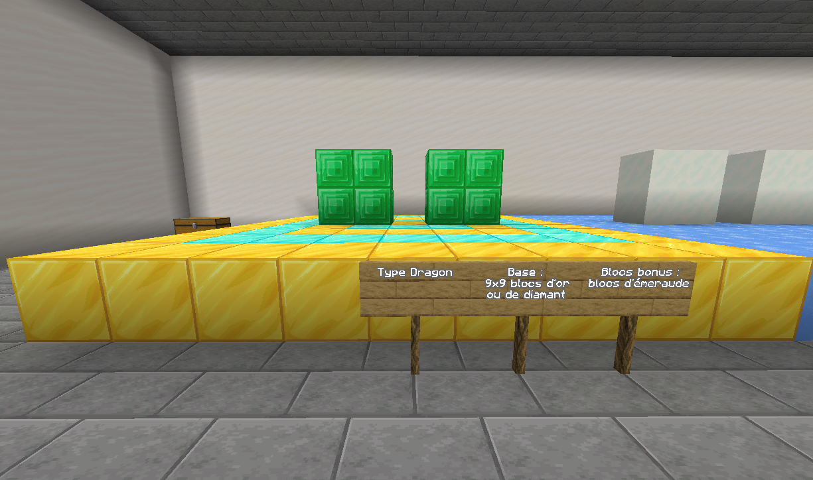<figcaption>
<mark style="color:blue;"><strong><code>Structure pour les Pokémons Dragon</code></strong></mark>
</figcaption></figure>

<figure>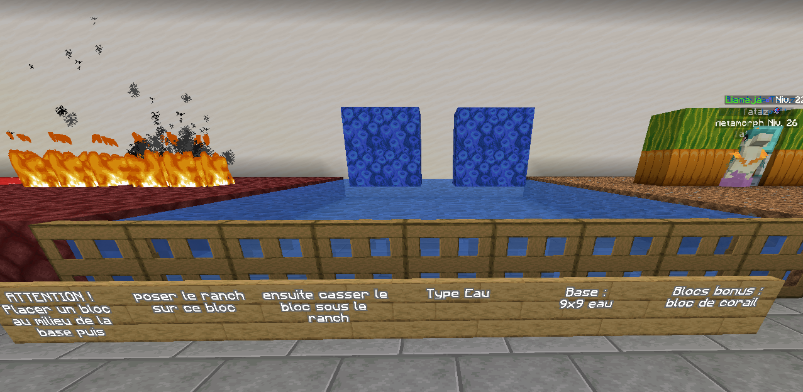<figcaption>
<mark style="color:blue;"><strong><code>Structure pour les Pokémons Eau</code></strong></mark>
</figcaption></figure>

<figure>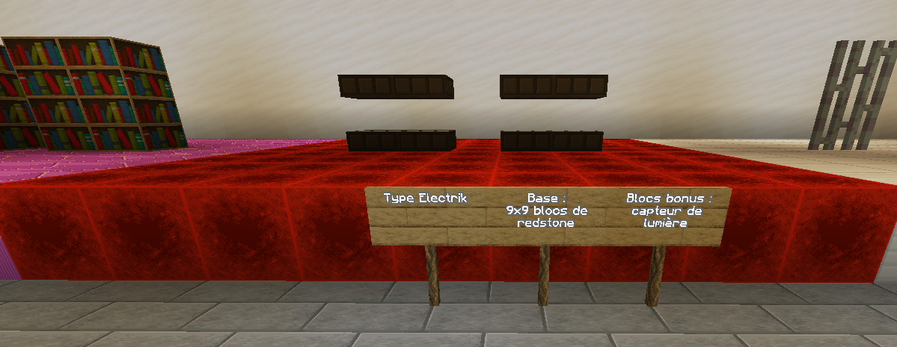<figcaption>
<mark style="color:blue;"><strong><code>Structure pour les Pokémons Electrique</code></strong></mark>
</figcaption></figure>

<figure><figcaption>
<mark style="color:blue;"><strong><code>Structure pour les Pokémons Fée</code></strong></mark>
</figcaption></figure>

<figure>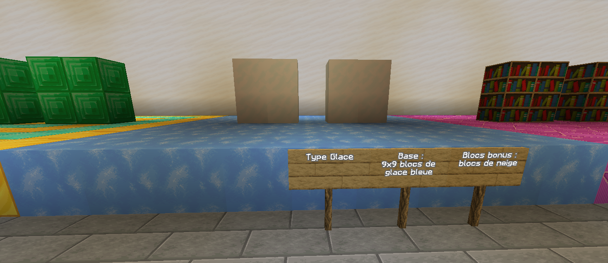<figcaption>
<mark style="color:blue;"><strong><code>Structure pour les Pokémons Glace</code></strong></mark>
</figcaption></figure>

<figure>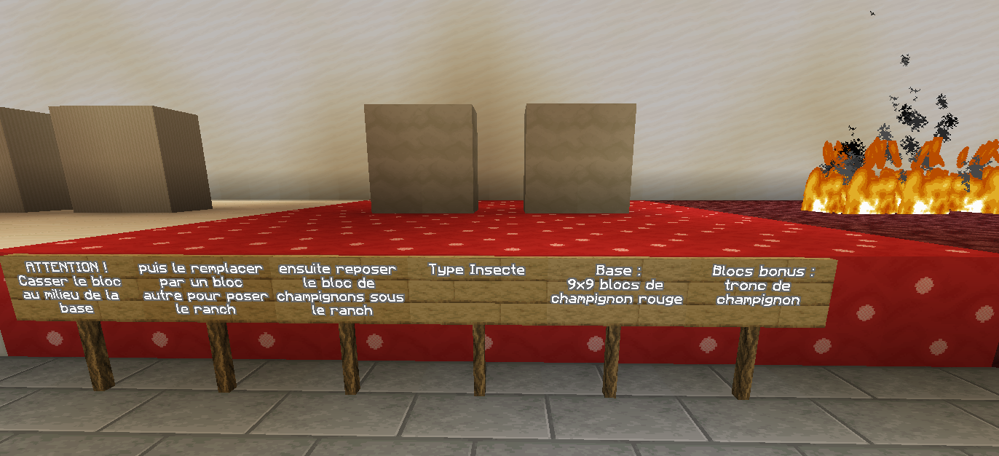<figcaption>
<mark style="color:blue;"><strong><code>Structure pour les Pokémons Insecte</code></strong></mark>
</figcaption></figure>

<figure>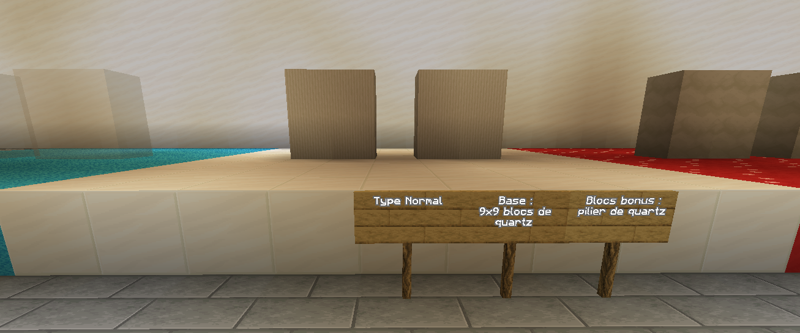<figcaption>
<mark style="color:blue;"><strong><code>Structure pour les Pokémons Normal</code></strong></mark>
</figcaption></figure>

<figure>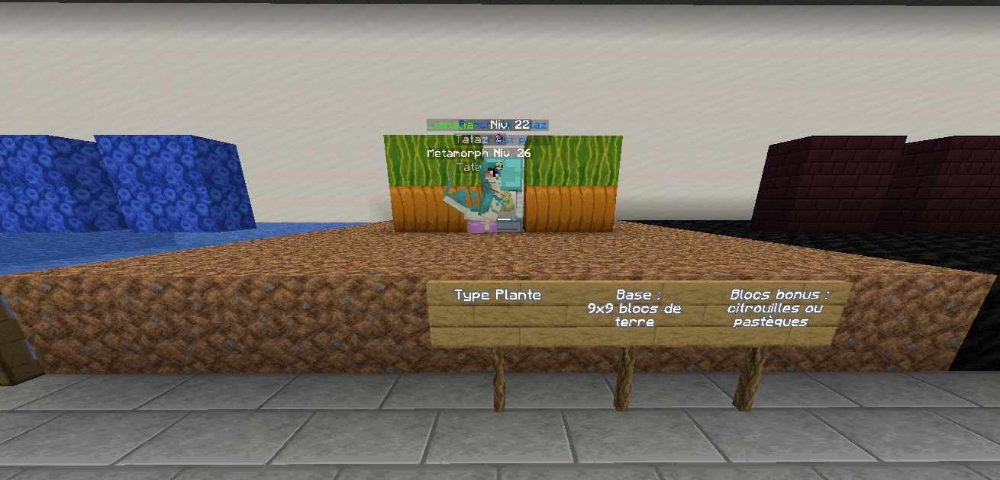<figcaption>
<mark style="color:blue;"><strong><code>Structure pour les Pokémons Plante</code></strong></mark>
</figcaption></figure>

<figure>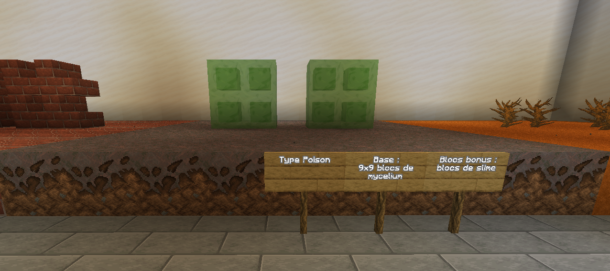<figcaption>
<mark style="color:blue;"><strong><code>Structure pour les Pokémons Poison</code></strong></mark>
</figcaption></figure>

<figure>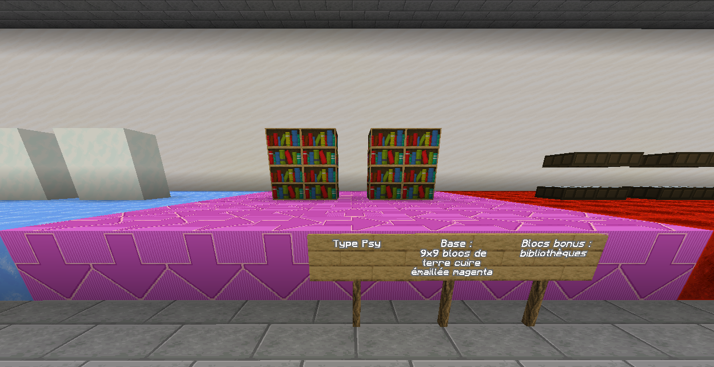<figcaption>
<mark style="color:blue;"><strong><code>Structure pour les Pokémons Psy</code></strong></mark>
</figcaption></figure>

<figure>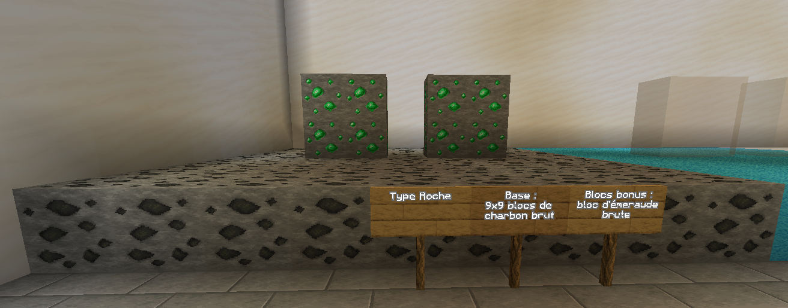<figcaption>
<mark style="color:blue;"><strong><code>Structure pour les Pokémons Roche</code></strong></mark>
</figcaption></figure>

<figure>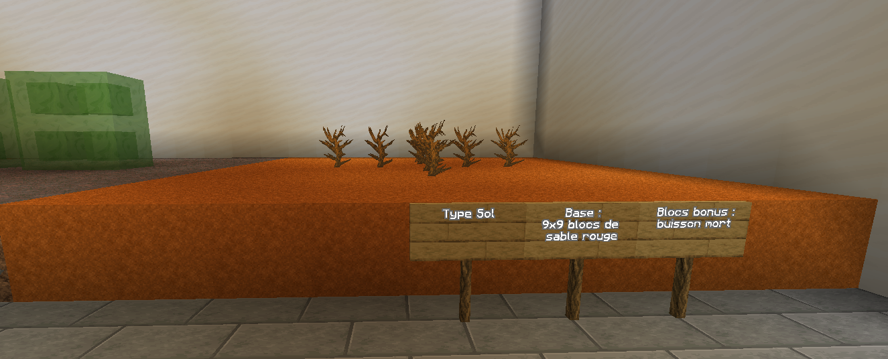<figcaption>
<mark style="color:blue;"><strong><code>Structure pour les Pokémons Sol</code></strong></mark>
</figcaption></figure>

<figure>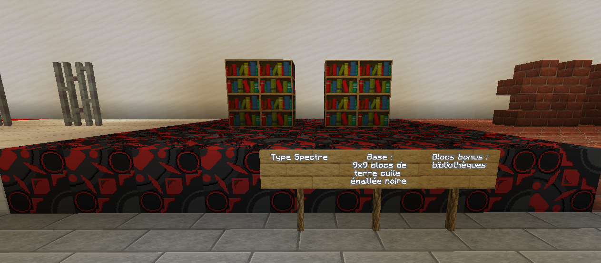<figcaption>
<mark style="color:blue;"><strong><code>Structure pour les Pokémons Spectre</code></strong></mark>
</figcaption></figure>

<figure>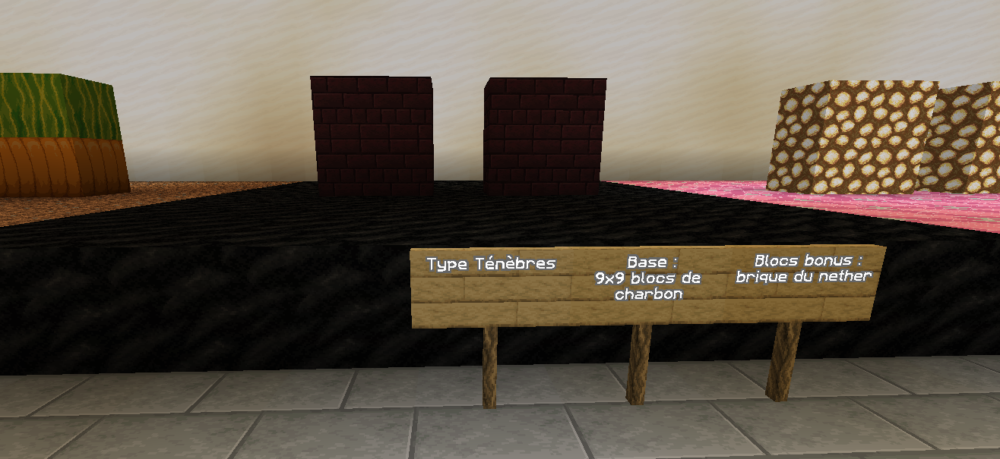<figcaption>
<mark style="color:blue;"><strong><code>Structure pour les Pokémons Ténèbres</code></strong></mark>
</figcaption></figure>

<figure>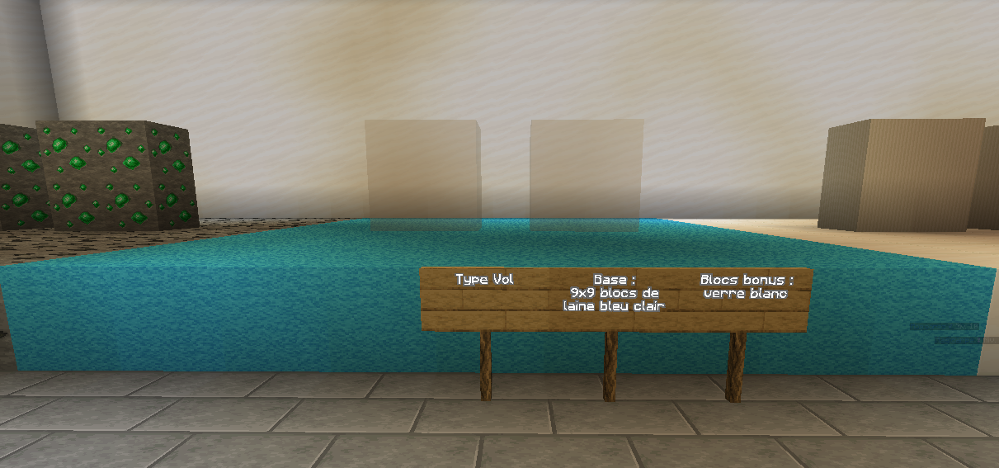<figcaption>
<mark style="color:blue;"><strong><code>Structure pour les Pokémons Vol</code></strong></mark>
</figcaption></figure>

## 🔄 Récupération du Ranch
Le Ranch peut être <mark style="color:blue;">**détruit avec une pioche**</mark> et sera <mark style="color:blue;">**récupérable**</mark> pour être replacé ailleurs. L'item <mark style="color:blue;">**Mise à jour hors ligne**</mark> sera lâché lors du procédé.

---
*Dernière mise à jour : [21/03/2025]*
