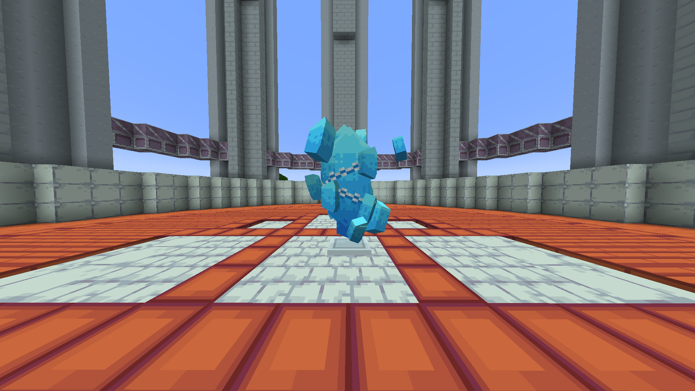

# ⛪ Arènes

## <mark style="color:blue;">Informations Générales</mark>

* Les <mark style="color:blue;">**arènes Pokémon**</mark> sont dispersées dans les <mark style="color:blue;">**mondes Construction**</mark>.
* Chaque monde contient <mark style="color:blue;">**10 arènes Pokémon**</mark>.

Prenez le contrôle d’une arène en <mark style="color:blue;">**battant le champion actuel**</mark> et en <mark style="color:blue;">**plaçant votre propre équipe de Pokémon surentraînés**</mark> pour défendre l’arène.


En cas de défaite face à l’équipe dominante de l’arène, vous devrez attendre <mark style="color:blue;">**1 heure**</mark> avant de pouvoir retenter votre chance.


Plus votre équipe <mark style="color:blue;">**reste longtemps en place**</mark> dans l’arène, <mark style="color:blue;">**plus vous recevrez de récompenses**</mark>.

<figure><figcaption>
<strong>Aperçu du menu d'une </strong><mark style="color:blue;"><strong>Arène</strong></mark>
</figcaption></figure>

## <mark style="color:blue;">R</mark><mark style="color:blue;">**écompenses des Arènes**</mark>

| <mark style="color:blue;">**Temps passé**</mark>            | <mark style="color:blue;">**Récompense**</mark>                |
| ----------------------------------------------------------- | -------------------------------------------------------------- |
| <mark style="color:green;">**Toutes les 5 minutes**</mark>  | <mark style="color:green;">**250 PokéCoins**</mark>            |
| <mark style="color:yellow;">**Toutes les 2 heures**</mark>  | <mark style="color:yellow;">**1 Super Bonbon**</mark>          |
| <mark style="color:purple;">**Toutes les 12 heures**</mark> | <mark style="color:purple;">**1 Œuf Pokémon Aléatoire**</mark> |

<figure><figcaption>
<strong>Aperçu d'une </strong><mark style="color:blue;"><strong>Arène</strong></mark>
</figcaption></figure>

<figure><figcaption>
<strong>Aperçu d'une </strong><mark style="color:blue;"><strong>Arène</strong></mark>
</figcaption></figure>
